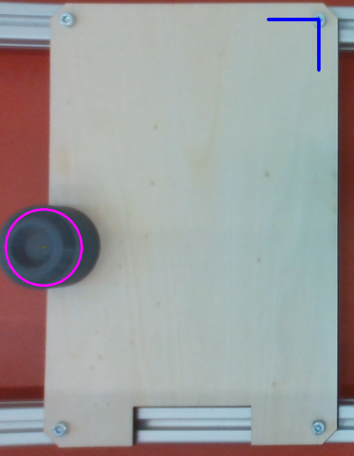

# SamyPlugin for Intel Realsense D435 camera in the FHTW UseCase

This Plugin operates a Intel Realsense D435 camera to recognize and publish the position of a workpiece.
Although this plugin was created specifically for the FHTW use case, it can act as a guide for other use cases through customizations and extensions. The scope of this guide is to show how to connect a Intel Realsense D435 camera through a docker environment to publish a pose useable for a robot within the SAMY framework.

To build the plugin go to the root folder of KameraUsecasePlugin :
```console
$ sudo docker build -t camera .
```
All image processing functions are handled in the file *kamera.py*.<br>
In this specific usecase the image processing is done with the *opencv-python* library.

The output of the image is a pose which has to be transformed in the format of the CRCL datatype **MoveToParametersSetDataType**, such as a robot is able to read the pose and in further sense to move to the pose. The Intel Realsense D435 camera features the recording of depth information. In this version of the plugin only the RGB camera is used. Therefore the camera returns only the **X_position** and **Y_position** in the camera coordinate system.

The following picture shows the coordinate system marked in blue set on a static point in the camera picture.<br>
The workpiece is marked with a pink circle with the center of the recognized object displayed with a yellow point.



The calculation of the object/workpiece position to the robot pose is highly custom depending on the specific usecase. In this specific case the transformation in the robot coordinate system is done by a static transformation. This is a result of the always static position of the Intel Realsense D435 camera.

In general the plugin publishes the **MoveToParametersSetDataType** with:


| **MoveToParametersSetDataType** | Value     |        
| ------------- |:-------------:              |
| EndPosition.point.x | **from camera**       |
| EndPosition.point.y | **from camera**       | 
| EndPosition.point.z | fixed/custom          |
| EndPosition.xAxis.i | fixed/custom          |
| EndPosition.xAxis.j | fixed/custom          |
| EndPosition.xAxis.k | fixed/custom          |
| EndPosition.zAxis.i | fixed/custom          |
| EndPosition.zAxis.j | fixed/custom          |
| EndPosition.zAxis.k | fixed/custom          |

This defines the CRCL pose to let a robot read it and grab the object/workpiece.
> Notice: most of the parameter of the **MoveToParametersSetDataType** are fixed so that the robot reaches the pose always with the same configuration.

## Sending Information to the SAMY Core

The pose of the object/workpiece is sent by an information source.<br>
With the *GetStatus* skill the plugin gets triggered to take a picture and send back the **MoveToParametersSetDataType**. If an object is detected in the picture, the coordinates can be used to manipulate it in further steps.
